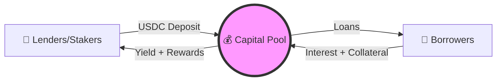
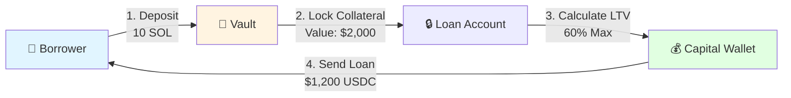
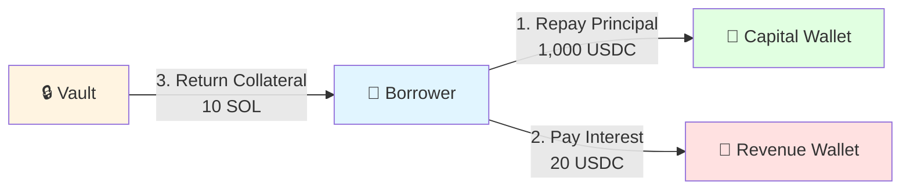
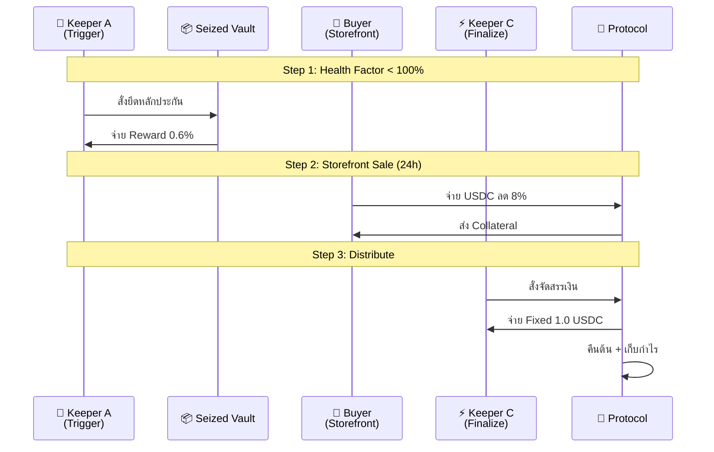

# 🏛️ Ginva DeFi Protocol

> **Next-Generation Lending Protocol with Task-Based Liquidation on Solana**

[](LICENSE)
[](https://explorer.solana.com)
[](https://anchor-lang.com)
[](https://github.com/Amnat3232/ginva)

## 📖 ภาพรวมระบบ (Overview)

**Ginva Protocol** คือระบบ Lending/Borrowing บน Solana ที่มีจุดเด่นคือระบบ **Liquidation แบบ 3 ขั้นตอน (Task-Based)** ที่แบ่งงานให้ Keepers (Bots) ทำงานร่วมกันเพื่อประสิทธิภาพสูงสุด ลดความเสี่ยงหนี้เสีย และสร้างความเป็นธรรมให้กับทุกฝ่าย

### 🎯 ปรัชญาหลัก (Core Philosophy)



---

## 🔄 Flow การทำงานหลัก (Core Flows)

### 1️⃣ ฝากเงินและกู้ (Deposit & Borrow)



**ตัวอย่างการคำนวณ:**

```
ฝาก: 10 SOL (มูลค่า $2,000 @ $200/SOL)
LTV 60%: $2,000 × 0.60 = $1,200 USDC (ที่กู้ได้)
ดอกเบี้ย: 8% APR (Dynamic Rate)
```

---

### 2️⃣ คืนเงินกู้ (Repay Loan)



**การไหลของเงิน:**

| ประเภท         | จำนวน      | ไปที่          | วัตถุประสงค์                   |
| -------------- | ---------- | -------------- | ------------------------------ |
| **Principal**  | 1,000 USDC | Capital Wallet | คืนเงินต้นให้ระบบ              |
| **Interest**   | 20 USDC    | Revenue Wallet | แจก Stakers / Protocol Revenue |
| **Collateral** | 10 SOL     | Borrower       | คืนหลักประกันเต็มจำนวน         |

---

### 3️⃣ การชำระบัญชี (Liquidation) - 🌊 3-Step Waterfall

ระบบ Liquidation ของ Ginva ออกแบบมาเพื่อความรวดเร็วและป้องกันการผูกขาด:



---

## 💰 ตัวอย่างการแบ่งเงิน (Distribution Example)

**Scenario:** ยึดหลักประกัน 10 SOL (Market: $2,000) | หนี้: $1,200

| Step            | Actor    | Action          | Calculation          | ผลลัพธ์              |
| --------------- | -------- | --------------- | -------------------- | -------------------- |
| **1. Trigger**  | Keeper A | รับ 0.6% Reward | $2,000 × 0.006       | **$12** (0.06 SOL)   |
|                 |          | เข้า Vault      | $2,000 - $12         | **$1,988**           |
| **2. Swap**     | Buyer    | ซื้อลด 8%       | $1,988 × 0.92        | จ่าย **$1,828** USDC |
| **3. Finalize** | Keeper C | Fixed Reward    | -                    | **$1.00** USDC       |
|                 | Capital  | คืนเงินต้น      | -                    | **$1,200** USDC      |
|                 | Protocol | กำไร            | $1,828 - $1 - $1,200 | **~$627** USDC       |

---

## 🎭 ตัวละครในระบบ (Actors)

| บทบาท           | หน้าที่                                | รางวัล                          | ความเสี่ยง                      |
| --------------- | -------------------------------------- | ------------------------------- | ------------------------------- |
| 👤 **Borrower** | ฝาก Collateral, กู้ USDC, จ่ายดอกเบี้ย | ได้สภาพคล่อง                    | ถูก Liquidate ถ้า LTV สูงเกินไป |
| 🏦 **Lender**   | ฝาก USDC เข้า Capital Pool             | ดอกเบี้ย 8% APR + Revenue Share | Smart contract risk             |
| 🔨 **Keeper A** | ตรวจจับหนี้เสีย, Trigger liquidation   | 0.6% ของ Collateral             | Gas cost, Opportunity cost      |
| 🛒 **Buyer**    | ซื้อ Collateral จาก Storefront         | ส่วนลด 8% จากตลาด               | ราคา Collateral ผันผวน          |
| ⚡ **Keeper C** | Finalize, จัดสรรเงิน                   | Fixed 1.0 USDC                  | Gas cost                        |

---

## 📊 Economic Model

### Dynamic Interest Rate

```
Base Rate: 8% APR

ถ้า Utilization < 80%:
  Interest Rate = Base Rate + (Utilization × 0.5%)

ถ้า Utilization ≥ 80%:
  Interest Rate = Base Rate + 4% + ((Utilization - 80%) × 2%)

Max Rate: 50% APR (Hard Cap)
```

**ตัวอย่าง:**

- Utilization 60% → Rate = 8% + (60 × 0.5%) = **11%**
- Utilization 90% → Rate = 8% + 4% + (10 × 2%) = **22%**

### Revenue Distribution

```
Protocol Revenue จาก:
├── Interest (จาก Borrowers)
├── Liquidation Profits
└── Protocol Fees

Allocation:
├── 100% → Revenue Wallet
└── แจก Stakers ตามสัดส่วนการฝาก
```

---

## 🛡️ Security Features

| Feature                       | รายละเอียด                                              |
| ----------------------------- | ------------------------------------------------------- |
| ✅ **Flash Loan Protection**  | ต้องถือครอง Collateral อย่างน้อย 2 วินาทีก่อนกู้        |
| ✅ **Rate Limiting**          | จำกัด 5 transactions ต่อ block ต่อ user                 |
| ✅ **Emergency Pause**        | Admin สามารถหยุดระบบได้ทันที (48h timelock ก่อน resume) |
| ✅ **Fail-Safe Distribution** | Priority: Keeper C → Principal → Protocol (ป้องกันค้าง) |
| ✅ **Price Deviation Check**  | Oracle price ต้องไม่ผันผวนเกิน 5% จากรอบก่อน            |
| ✅ **Reentrancy Guards**      | ป้องกันการเรียก function ซ้ำในขณะ execute               |

---

## 📁 โครงสร้างโปรเจค (Project Structure)

```
ginva/
├── 📁 programs/
│   └── ginva/                 # Smart Contract (Rust/Anchor)
│       └── src/
│           ├── lib.rs         # Main program logic
│           ├── state.rs       # Account structures
│           └── error.rs       # Custom error codes
│
├── 📁 tests/
│   ├── ginva.ts              # Main integration tests
│   ├── repay_loan_test.ts    # Repayment flow tests
│   └── liquidation_test.ts   # Liquidation flow tests
│
├── 📁 app/                   # Frontend (Next.js + React)
│   ├── components/
│   ├── hooks/
│   └── pages/
│
├── 📄 Anchor.toml            # Anchor configuration
├── 📄 Cargo.toml             # Rust dependencies
└── 📄 package.json           # Node.js dependencies
```

---

## 🚀 Quick Start

### 1. Prerequisites

```bash
# Install Solana CLI
sh -c "$(curl -sSfL https://release.solana.com/v1.18.0/install)"

# Install Anchor
cargo install --git https://github.com/coral-xyz/anchor avm --locked --force
avm install latest
avm use latest

# Verify installations
solana --version
anchor --version
```

### 2. Clone & Setup

```bash
# Clone repository
git clone https://github.com/Amnat3232/ginva.git
cd ginva

# Install dependencies
yarn install

# Generate types
anchor build
```

### 3. Run Tests

```bash
# Run all tests
anchor test

# Run specific test suite
anchor test --grep "Loan Repayment"
anchor test --grep "Liquidation"

# Run with verbose output
anchor test --verbose
```

### 4. Deploy to Devnet

```bash
# Configure Solana CLI
solana config set --url devnet

# Create/Load wallet
solana-keygen new --outfile ~/.config/solana/devnet.json
solana config set --keypair ~/.config/solana/devnet.json

# Airdrop SOL for deployment
solana airdrop 2

# Deploy program
anchor deploy --provider.cluster devnet

# Verify deployment
solana program show <PROGRAM_ID>
```

---

## 🚀 Deployment

### Frontend (Vercel)

```
┌─────────────────────────────────────────────────────────────────┐
│  📍 DEPLOY TO VERCEL (Free & Automatic)                         │
├─────────────────────────────────────────────────────────────────┤
│                                                                 │
│  1️⃣ Push code to GitHub                                        │
│     git add .                                                   │
│     git commit -m "feat: prepare for vercel"                    │
│     git push origin develop                                     │
│                                                                 │
│  2️⃣ Go to https://vercel.com                                   │
│                                                                 │
│  3️⃣ Sign Up with GitHub                                        │
│                                                                 │
│  4️⃣ Import Repository: ginva                                   │
│                                                                 │
│  5️⃣ Configure:                                                 │
│     - Root Directory: app                                       │
│     - Build Command: npm run build                              │
│     - Output Directory: dist                                    │
│                                                                 │
│  6️⃣ Add Environment Variables:                                 │
│     VITE_GINVA_PROGRAM_ID = (from anchor build)                 │
│     VITE_SOLANA_RPC_ENDPOINT = https://api.devnet.solana.com   │
│     VITE_SOLANA_NETWORK = devnet                                │
│                                                                 │
│  7️⃣ Click Deploy!                                              │
│                                                                 │
│  🌐 Your URL: https://ginva.vercel.app                         │
│                                                                 │
│  🔄 Auto-deploys on every git push!                             │
│                                                                 │
└─────────────────────────────────────────────────────────────────┘
```

### Program (Solana Devnet)

```bash
# Airdrop SOL for deployment
solana airdrop 2

# Deploy program
anchor deploy --provider.cluster devnet

# Verify deployment
solana program show <PROGRAM_ID>
```

---

## 🔗 Resources & Links

- 📖 **Documentation**: [docs.ginva.io](https://docs.ginva.io) _(Coming Soon)_
- 💬 **Discord Community**: [Join Discord](https://discord.gg/ginva) _(Coming Soon)_
- 🐦 **Twitter**: [@ginva_protocol](https://twitter.com/ginva_protocol) _(Coming Soon)_
- 📊 **Devnet Explorer**: [View on Solana Explorer](https://explorer.solana.com/?cluster=devnet)
- 📝 **Whitepaper**: [Read Whitepaper](./WHITEPAPER.md) _(Coming Soon)_

---

## 🗓️ Development Roadmap (สำหรับนักพัฒนา)

> **⚠️ หมายเหตุสำคัญ**: รายการด้านล่างคือ **TODO List สำหรับนักพัฒนา** เพื่อติดตามว่าจะพัฒนาต่อไปอะไร ไม่ใช่คำอธิบายฟีเจอร์ทั้งหมดของระบบ!
>
> Ginva Protocol **มีฟังก์ชันครบแล้ว** ดังนี้:
>
> - ✅ ระบบ Liquidation 3 ขั้นตอน + รางวัล Keeper
> - ✅ การแบ่งดอกเบี้ย (10% Capital, 27.5% Ops, 65.25% Stakers)
> - ✅ ระบบ Emergency Pause
> - ✅ รองรับหลายสินทรัพย์ (SOL, BTC, ETH ผ่าน AssetConfig)
> - ✅ ระบบ Staking และ Rewards
>
> ดูรายละเอียดระบบที่ **[Architecture](#-architecture)** และ **[Core Flows](#-flow-การทำงานหลัก-core-flows)**
>
> รายการด้านล่างจะถูกลบออกเมื่อเสร็จสิ้นและย้ายไป [CHANGELOG.md](./CHANGELOG.md)

### 🚨 Phase 1: Pre-Deploy (Critical - Do First)

- [x] **LICENSE** - Create LICENSE file (BUSL-1.1 with 4-year exclusivity)
- [x] **FIX: Hardcoded Feed ID** - Replace SOL_USD_FEED_ID with dynamic asset_config.feed_id
- [x] **FIX: Debt Accounting** - Use full loan_amount in finalize_liquidation (prevent zombie debt)
- [x] **.env.example** - Environment variables template with documentation
- [x] **CI/CD** - GitHub Actions workflow for automated testing
- [x] **SECURITY.md** - Vulnerability reporting process

### 🎯 Phase 2: Development (Build the System)

- [x] **Frontend Structure** - React + Vite + Tailwind + Chakra UI skeleton
- [x] **Deploy to Vercel** - Host frontend on Vercel (Devnet)
- [ ] **Keeper Bot** - TypeScript bot script for liquidation
- [ ] **Test Keeper Bot** - Run and validate on Devnet
- [ ] **CHANGELOG.md** - Version tracking
- [ ] **API Docs** - Documentation for all program instructions

### 🔒 Phase 3: Security & Testing (Before Mainnet)

- [ ] **Security Audit** - Third-party audit of smart contracts
- [ ] **Edge Case Tests** - 100+ users, leap year, extreme conditions
- [ ] **CODE_OF_CONDUCT.md** - Community guidelines
- [ ] **Backup Plan** - Recovery procedures

### 🚀 Phase 4: Mainnet Launch (Production Ready)

- [ ] **Mainnet Deploy** - Deploy smart contracts to Solana Mainnet
- [ ] **Fleek Migration** - Move frontend to Fleek (Web3 hosting)
- [ ] **Whitepaper** - Technical whitepaper
- [ ] **Keeper Bot Docs** - Public documentation for bot operators

### 🌟 Phase 5: Growth (Expansion)

- [ ] **Domain** - Purchase ginva.io
- [ ] **Community** - Setup Discord and Twitter
- [ ] **Monitoring** - Logs, alerts, and analytics
- [ ] **Troubleshooting Guide** - FAQ and problem solving
- [ ] **Multisig** - Add multisig wallet support (when team grows)
- [ ] **More Assets** - Support ETH, BTC, and other collaterals

---

### 📊 Progress Tracker

```
Phase 1:  ██████████ 100%  (6/6 tasks) ✅ COMPLETE
Phase 2:  ████░░░░░░ 33%   (2/6 tasks)
Phase 3:  ░░░░░░░░░ 0%    (0/4 tasks)
Phase 4:  ░░░░░░░░░ 0%    (0/4 tasks)
Phase 5:  ░░░░░░░░░ 0%    (0/6 tasks)

Total:    ████░░░░░░ 33%   (8/24 tasks)
```

Phase 1: ██████████ 100% (6/6 tasks) ✅ COMPLETE
Phase 2: █░░░░░░░░░ 17% (1/6 tasks)
Phase 3: ░░░░░░░░░░ 0% (0/4 tasks)
Phase 4: ░░░░░░░░░░ 0% (0/4 tasks)
Phase 5: ░░░░░░░░░░ 0% (0/6 tasks)

Total: ███░░░░░░░ 29% (7/24 tasks)

```

**Legend:** ✅ Done | ⏳ In Progress | ⬜ Not Started

---

## 🤝 Contributing

We welcome contributions! Please see [CONTRIBUTING.md](./CONTRIBUTING.md) for guidelines.

1. Fork the repository
2. Create your feature branch (`git checkout -b feature/amazing-feature`)
3. Commit your changes (`git commit -m 'feat: Add amazing feature'`)
4. Push to the branch (`git push origin feature/amazing-feature`)
5. Open a Pull Request

---

## 📄 License

This project is licensed under the BUSL-1.1 License - see the [LICENSE](LICENSE) file for details.

---

<div align="center">

**Built with ❤️ on Solana**

[Website](https://ginva.io) • [Docs](https://docs.ginva.io) • [GitHub](https://github.com/Amnat3232/ginva) • [Twitter](https://twitter.com/ginva_protocol)

</div>
```
