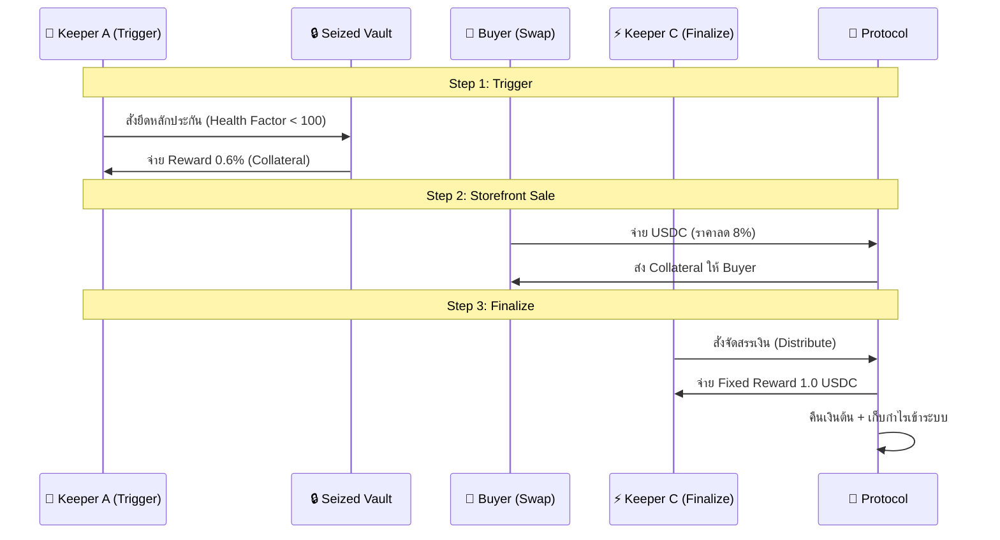

# 🏛️ Ginva DeFi Protocol

> **Next-Generation Lending Protocol with Task-Based Liquidation on Solana**


## 📖 ภาพรวมระบบ (Overview)

**Ginva Protocol** คือระบบ Lending/Borrowing บน Solana ที่มีจุดเด่นคือระบบ **Liquidation แบบ 3 ขั้นตอน (Task-Based)** ที่แบ่งงานให้ Keepers (Bots) ทำงานร่วมกันเพื่อประสิทธิภาพสูงสุด ลดความเสี่ยงหนี้เสีย และสร้างความเป็นธรรมให้กับทุกฝ่าย

---

## 🎯 ปรัชญาหลัก (Core Philosophy)


---

## 🔄 Flow การทำงานหลัก (Core Flow)

### 1️⃣ ฝากเงินและกู้ (Deposit & Borrow)

**Deposit**: ฝากสินทรัพย์ (เช่น SOL) เพื่อใช้เป็นหลักประกัน
**Borrow**: กู้ USDC ออกไป (Max LTV ตามกำหนด)

**Example:**

```
ฝาก: 10 SOL (มูลค่า ~$2,000)
กู้ได้: $1,200 USDC (60% LTV)
ดอกเบี้ย: 8% APR (Dynamic)
```

---

### 2️⃣ คืนเงินกู้ (Repay Loan)

การไหลของเงินเมื่อผู้กู้ชำระคืน:

| ประเภทเงิน | จำนวน      | ไปที่ไหน (Destination) | วัตถุประสงค์                  |
| ---------- | ---------- | ---------------------- | ----------------------------- |
| Principal  | 1,000 USDC | Capital Wallet         | คืนเงินต้นเข้าระบบ            |
| Interest   | 20 USDC    | Revenue Wallet         | รายได้ Protocol / แจก Stakers |
| Collateral | 10 SOL     | Borrower               | คืนหลักประกันให้ผู้กู้        |

---

### 3️⃣ การชำระบัญชี (Liquidation) - 🌊 The 3-Step Waterfall

ระบบ Liquidation ของ Ginva ออกแบบมาเพื่อความรวดเร็วและป้องกันการผูกขาด โดยแบ่งหน้าที่ชัดเจน:



---

## 💰 ตัวอย่างการแบ่งเงิน (Distribution Example)

**Scenario:** ยึดหลักประกัน 10 SOL (Market Price $2,000) | หนี้สิน $1,200

| Step            | Action          | Detail                                                               |
| --------------- | --------------- | -------------------------------------------------------------------- |
| **1. Trigger**  | Keeper A        | รับ 0.6% = $12 (0.06 SOL) <br> เหลือเข้า Vault: $1,988               |
| **2. Swap**     | Auto-Swap Buyer | ซื้อของมูลค่า $1,988 ในราคา **ลด 8%** <br> _Buyer จ่าย: $1,828 USDC_ |
| **3. Finalize** | Keeper C        | จ่าย **Fixed 1.0 USDC** <br> คืนต้น $1,200 <br> กำไรเข้าระบบ ~$627   |

---

## 🎭 ตัวละครในระบบ (Actors)

| บทบาท (Role)    | หน้าที่ (Responsibility)               | สิ่งที่ได้รับ (Incentive)     |
| --------------- | -------------------------------------- | ----------------------------- |
| 👤 **Borrower** | ฝาก Collateral, กู้ USDC, จ่ายดอกเบี้ย | สภาพคล่อง (Liquidity)         |
| 🏦 **Lender**   | ฝาก USDC เข้า Capital Pool             | ดอกเบี้ย + ส่วนแบ่งรายได้     |
| 🔨 **Keeper A** | ตรวจจับหนี้เสีย และสั่ง Trigger        | 0.6% ของ Collateral           |
| 🛒 **Buyer**    | ซื้อ Collateral จาก Storefront         | ส่วนลด 8.0% จากราคาตลาด       |
| ⚡ **Keeper C** | สั่งปิดงานและจัดสรรเงิน (Finalize)     | 1.0 USDC (Fixed Priority Fee) |

---

## 🛡️ ความปลอดภัย & เศรษฐศาสตร์ (Security & Economics)

### Security Features

- ✅ **Flash Loan Protection**: ต้องถือครองอย่างน้อย 2 วินาที
- ✅ **Rate Limiting**: จำกัดจำนวน Transaction ต่อ Block
- ✅ **Emergency Pause**: Admin สามารถหยุดระบบได้ทันทีหากพบความผิดปกติ
- ✅ **Fail-Safe Distribution**: Logic การแบ่งเงินแบบ Priority (จ่าย Keeper -> คืนต้น) ป้องกันระบบค้าง

### Interest Model (Dynamic)

```
Base Rate: 8% APR
Utilization < 80%: ขยับขึ้นช้าๆ (Linear)
Utilization ≥ 80%: ขยับขึ้นแรง (Surge) เพื่อดึงดูดเงินฝาก
```

---

## 🚀 Quick Start

### 1. Install Dependencies

```bash
# Install Solana CLI
sh -c "$(curl -sSfL https://release.solana.com/v1.18.0/install)"

# Install Anchor
cargo install --git https://github.com/coral-xyz/anchor avm --locked --force
avm install latest
avm use latest
```

### 2. Build Project

```bash
# Clone repository
git clone https://github.com/DrSoloDev/ginva.git
cd ginva

# Install dependencies
yarn install

# Build program
anchor build
```

### 3. Run Tests

```bash
# Run all tests
anchor test

# Run specific test (e.g. Liquidation Logic)
anchor test --grep "Liquidation"
```

### 4. Deploy to Devnet

```bash
# Configure to devnet
solana config set --url devnet

# Airdrop SOL for deployment
solana airdrop 2

# Deploy
anchor deploy --provider.cluster devnet
```

---

## 📁 โครงสร้างโปรเจค (Project Structure)

```
ginva/
├── 📁 programs/
│   └── ginva/           # Smart Contract (Rust)
│       └── src/
│           ├── lib.rs   # Main Program Logic
│           ├── state.rs # Account Structs
│           └── error.rs # Custom Errors
├── 📁 tests/
│   └── ginva.ts         # Integration Tests
├── 📁 app/              # Frontend (Next.js)
├── 📄 Anchor.toml       # Anchor Configuration
└── 📄 Cargo.toml        # Rust Dependencies
```

---

## 🔗 สื่อการเรียนรู้เพิ่มเติม

- 📖 [Documentation](https://docs.ginva.io)
- 💬 [Discord Community](https://discord.gg/ginva)
- 🐦 [Twitter](https://twitter.com/ginva_protocol)
- 📊 [Devnet Explorer](https://explorer.solana.com)

---

<div align="center">

**Built with ❤️ by Dr.SoloDev on Solana**

[Website](https://ginva.io) • [Docs](https://docs.ginva.io) • [GitHub](https://github.com/ginva)

</div>
