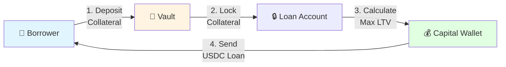
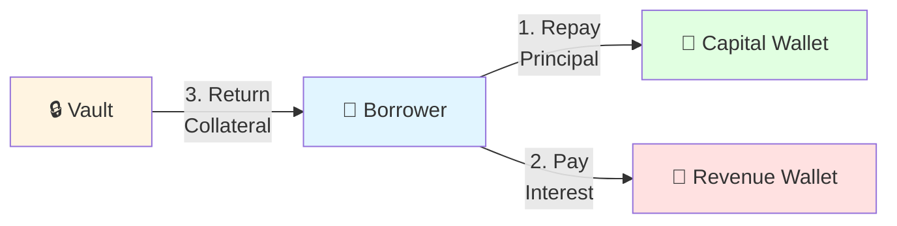
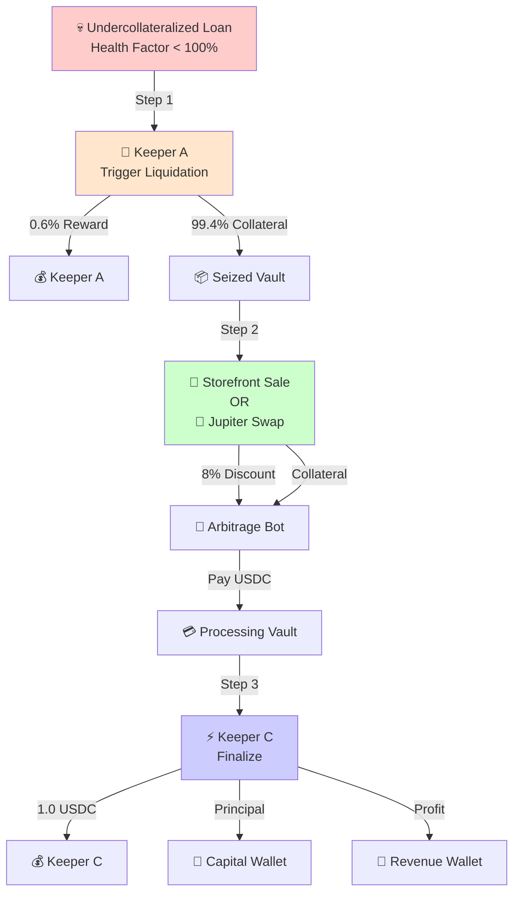
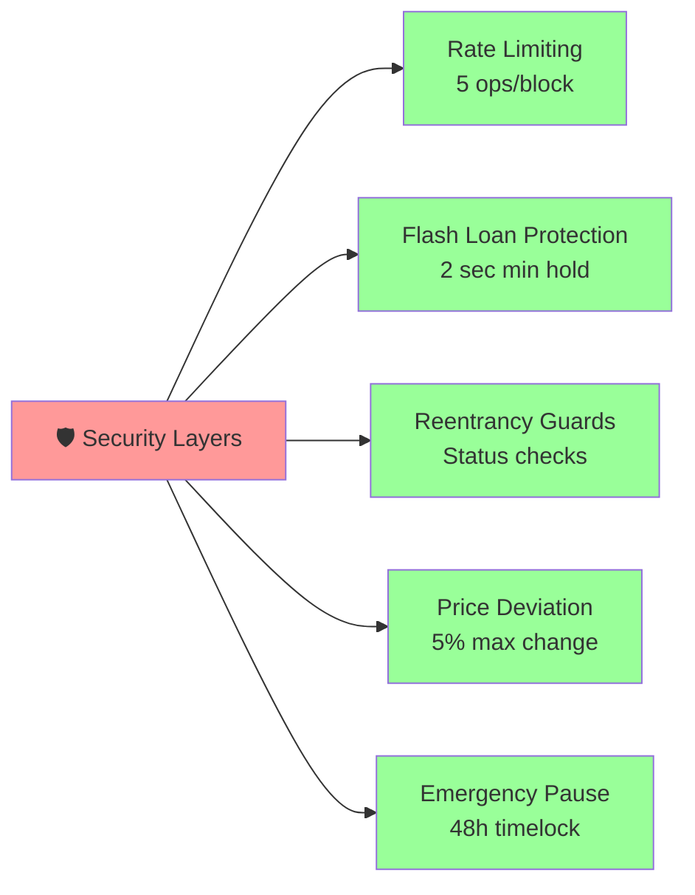

# 🏛️ Ginva DeFi Protocol

> **Next-Generation Lending Protocol with Task-Based Liquidation**

[](https://explorer.solana.com)
[](https://anchor-lang.com)
[](LICENSE)

---

## 📖 ภาพรวมระบบ (Overview)

Ginva Protocol คือระบบ **Lending/Borrowing** บน Solana ที่มีจุดเด่นคือระบบ **Liquidation แบบ 3 ขั้นตอน** แบ่งงานให้ Keepers (Bots) ทำงานร่วมกันเพื่อความมีประสิทธิภาพและความยุติธรรม

### 🎯 ปรัชญาหลัก

```
┌─────────────────────────────────────────────────────────┐
│  🏦 Lenders (Stakers)  ──>  💰 Capital Pool  ──>  👤 Borrowers  │
│         ▲                                              │
│         │                                              │
│    ดอกเบี้ย + รางวัล                        จ่ายดอกเบี้ย   │
└─────────────────────────────────────────────────────────┘
```

---

## 🔄 Flow การทำงานหลัก

### 1️⃣ ฝากเงินและกู้ (Deposit & Borrow)



**ตัวอย่าง:**

```
ฝาก: 10 SOL (มูลค่า $2,000)
กู้ได้: $1,200 USDC (60% LTV)
ดอกเบี้ย: 8% APR (Dynamic)
```

---

### 2️⃣ คืนเงินกู้ (Repay Loan)



**การไหลของเงิน:**
| ประเภท | จำนวน | ไปที่ | วัตถุประสงค์ |
|--------|-------|-------|--------------|
| Principal | 1,000 USDC | Capital Wallet | คืนเงินต้นให้ระบบ |
| Interest | 20 USDC | Revenue Wallet | แจก Stakers |
| Collateral | 10 SOL | Borrower | คืนหลักประกัน |

---

### 3️⃣ การชำระบัติ (Liquidation) - 3 Steps



#### 💰 การแบ่งเงิน (Distribution)

```
┌─────────────────────────────────────────────────────────┐
│  EXAMPLE: Liquidation of 10 SOL Collateral               │
│  Market Price: $2,000  |  Loan Debt: $1,200             │
├─────────────────────────────────────────────────────────┤
│  Step 1: Trigger (Keeper A)                             │
│  ├── Keeper A Reward: 0.6% = $12 (0.06 SOL)            │
│  └── To Seized Vault: 99.4% = $1,988 (9.94 SOL)        │
│                                                         │
│  Step 2: Storefront Sale (Auto-Swap Buyer)              │
│  ├── Buyer Pays: $1,828 (8% discount from $1,988)      │
│  └── Processing Vault Receives: $1,828 USDC            │
│                                                         │
│  Step 3: Finalize (Keeper C)                            │
│  ├── Keeper C Reward: $1.00 USDC (FIXED)               │
│  ├── Return Principal: $1,200 USDC                     │
│  └── Protocol Revenue: $627 USDC                       │
└─────────────────────────────────────────────────────────┘
```

---

## 🎭 ตัวละครในระบบ (Actors)

| บทบาท                   | หน้าที่                                | สิ่งที่ได้รับ             |
| ----------------------- | -------------------------------------- | ------------------------- |
| **👤 Borrower**         | ฝาก collateral, กู้ USDC, จ่ายดอกเบี้ย | สภาพคล่องจาก collateral   |
| **🏦 Lender/Staker**    | ฝาก USDC เข้า Capital Pool             | ดอกเบี้ย + ส่วนแบ่งรายได้ |
| **🔨 Keeper A**         | ตรวจจับและ trigger liquidation         | 0.6% ของ collateral       |
| **🛒 Storefront Buyer** | ซื้อ collateral ลดราคา                 | Collateral ในราคาลด 8%    |
| **⚡ Keeper C**         | จัดสรรเงินและ finalize                 | 1.0 USDC (fixed)          |

---

## 🛡️ ระบบรักษาความปลอดภัย

### Security Features



---

## 📊 Economic Model

### การคำนวณดอกเบี้ยแบบ Dynamic

```
Base Rate: 8% APR

ถ้า Utilization < 80%:
  Interest Rate = Base Rate + (Utilization × Slope1)

ถ้า Utilization ≥ 80%:
  Interest Rate = Base Rate + Surge Rate

Max Rate: 50% APR (กันโหมด)
```

### การกระจายรายได้ (Revenue Distribution)

```
┌────────────────────────────────────────┐
│  Protocol Revenue Sources:              │
│  1. Interest from borrowers            │
│  2. Liquidation profits                │
│  3. Protocol fees                      │
├────────────────────────────────────────┤
│  Allocation:                            │
│  ├── 100% → Revenue Wallet             │
│  └── แจก Stakers ตามสัดส่วน            │
└────────────────────────────────────────┘
```

---

## 🚀 Quick Start

### 1. Install Dependencies

```bash
# Install Solana CLI
sh -c "$(curl -sSfL https://release.solana.com/v1.18.0/install)"

# Install Anchor
cargo install --git https://github.com/coral-xyz/anchor avm --locked --force
avm install latest
avm use latest
```

### 2. Build Project

```bash
# Clone repository
git clone https://github.com/yourusername/ginva.git
cd ginva

# Install dependencies
yarn install

# Build program
anchor build
```

### 3. Run Tests

```bash
# Run all tests
anchor test

# Run specific test
anchor test --grep "Liquidation"
```

### 4. Deploy to Devnet

```bash
# Configure to devnet
solana config set --url devnet

# Airdrop SOL for deployment
solana airdrop 2

# Deploy
anchor deploy --provider.cluster devnet
```

---

## 📁 โครงสร้างโปรเจค

```
ginva/
├── 📁 programs/
│   └── ginva/           # Smart contract (Rust)
│       └── src/
│           └── lib.rs   # Main program logic
├── 📁 tests/
│   └── ginva.ts        # Integration tests
├── 📁 app/             # Frontend (Next.js)
│   └── src/
├── 📄 Anchor.toml      # Anchor configuration
├── 📄 Cargo.toml       # Rust dependencies
└── 📄 README.md        # This file
```

---

## 🔗 สื่อการเรียนรู้เพิ่มเติม

- 📖 [Documentation](https://docs.ginva.io)
- 💬 [Discord Community](https://discord.gg/ginva)
- 🐦 [Twitter](https://twitter.com/ginva_protocol)
- 📊 [Devnet Explorer](https://explorer.solana.com/address/YOUR_PROGRAM_ID?cluster=devnet)

---

## 📝 License

MIT License - see [LICENSE](LICENSE) for details

---

<div align="center">

**Built with ❤️ on Solana**

[Website](https://ginva.io) • [Docs](https://docs.ginva.io) • [GitHub](https://github.com/ginva)

</div>
