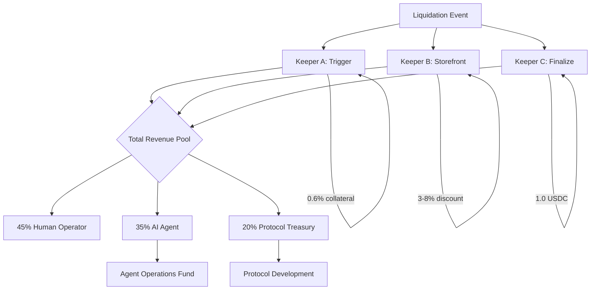
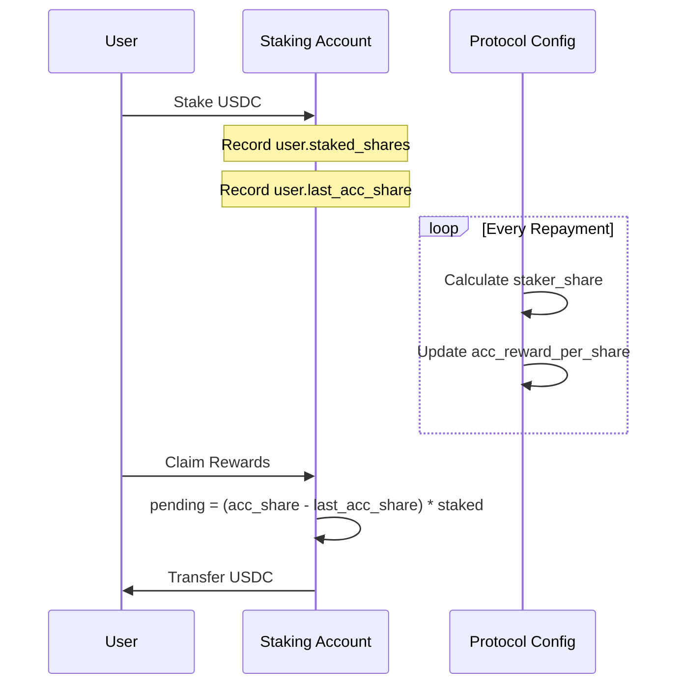

# Revenue Share Logic

> Comprehensive breakdown of GINVA's revenue distribution system.

## Overview

The GINVA Protocol generates revenue from liquidation operations and distributes it through a structured waterfall:

1. **Liquidation Trigger** → Keeper A receives 0.6% of collateral
2. **Storefront Discount** → Keeper B receives time-based discount (3-8%)
3. **Finalization** → Keeper C receives fixed 1.0 USDC reward
4. **AI Agent Revenue** → 35% of net revenue to AI agents
5. **Protocol Treasury** → 20% retained for protocol operations

## Revenue Sources

### 1. Liquidation Trigger Rewards (Keeper A)

When a position becomes unhealthy (Health Factor < 100%), the first keeper to trigger liquidation receives:

- **Reward Rate**: 0.6% of seized collateral (`lib.rs:51`)
- **Check Interval**: Every 5 seconds
- **Payment**: USDC directly to keeper's wallet

```rust
// From lib.rs:51 - APR in basis points
pub const APR: u64 = 800;  // 8% annual rate
```

The trigger reward incentivizes rapid response to underwater positions, maintaining protocol solvency.

### 2. Storefront Discount Revenue (Keeper B)

Keeper B operates as the storefront buyer, purchasing collateral at discounted rates:

- **Discount Range**: 3% to 8% based on time elapsed
- **Interval**: Checks every 2 seconds
- **Revenue Source**: Spread between market price and discounted purchase price

```typescript
// Pseudocode for discount calculation
const elapsedHours = (now - liquidationTriggerTime) / 3600;
const discountBps = Math.min(800, 300 + (elapsedHours * 50)); // 3-8%
const discount = collateralValue * (discountBps / 10000);
const purchasePrice = collateralValue - discount;
```

### 3. Finalization Rewards (Keeper C)

The final keeper receives a fixed reward for completing the liquidation:

- **Fixed Reward**: 1.0 USDC per liquidation
- **Grace Period**: 72 hours after trigger
- **Check Interval**: Continuous monitoring

### 4. AI Agent Revenue Share

Revenue from keeper operations is shared with AI agents that assist in decision-making:

| Stakeholder | Share | Basis Points |
|-------------|-------|-------------|
| Human Operators | 45% | 4500 bps |
| AI Agents | 35% | 3500 bps |
| Protocol Treasury | 20% | 2000 bps |

Source: `lib.rs:83-85`

```rust
pub const AGENT_REVENUE_HUMAN_SHARE_BPS: u16 = 4500;    // 45%
pub const AGENT_REVENUE_AI_SHARE_BPS: u16 = 3500;      // 35%
pub const AGENT_REVENUE_PROTOCOL_SHARE_BPS: u16 = 2000; // 20%
```

## Distribution Architecture



## Staker Reward System

Protocol revenue from interest is also distributed to stakers using an accumulator pattern:

```rust
// From ginva/src/lib.rs:1359-1382
let reward_with_precision = (staker_share as u128) * INTEREST_PRECISION;
let reward_per_share_increment = reward_with_precision
    .checked_div(total_staked)
    .unwrap_or(0);

system_config.acc_reward_per_share = system_config
    .acc_reward_per_share
    .checked_add(reward_per_share_increment)
    .unwrap_or(0);
```

### Accrued Reward Per Share (acc_reward_per_share)

The protocol tracks staker earnings using:

- **Accumulator Pattern**: `acc_reward_per_share` increases with each distribution
- **Precision**: `INTEREST_PERCISION = 1_000_000` (`lib.rs:37`)
- **Claim**: Users claim difference between current and last claimed share



## Protocol Configuration

| Parameter | Value | Source |
|-----------|-------|--------|
| Liquidation Timeout | 86,400 seconds (24h) | `instructions.rs:649` |
| Auto-swap Reward | 1000 bps (10%) | `instructions.rs:652` |
| Distribution Reward | 2000 bps (20%) | `instructions.rs:655` |
| APR (Borrow Rate) | 8% | `lib.rs:51` |

```rust
// From instructions.rs:645-656
config_data[8..16].copy_from_slice(&86400i64.to_le_bytes());  // liquidation_timeout
config_data[16..18].copy_from_slice(&1000u16.to_le_bytes()); // auto_swap_reward_bps
config_data[18..20].copy_from_slice(&2000u16.to_le_bytes()); // distribute_reward_bps
```

## Keeper Revenue Calculation

### Example: Full Liquidation

Given a liquidation of 10,000 USDC collateral:

| Component | Calculation | Amount |
|-----------|-------------|--------|
| Keeper A (Trigger) | 10,000 × 0.6% | 60 USDC |
| Keeper B (Storefront) | 10,000 × 5% avg | 500 USDC |
| Keeper C (Finalize) | Fixed | 1 USDC |
| **Total Pool** | | **561 USDC** |

### Distribution:

| Stakeholder | Share | Amount |
|-------------|-------|--------|
| Human Operator | 45% | 252.45 USDC |
| AI Agent | 35% | 196.35 USDC |
| Protocol Treasury | 20% | 112.20 USDC |

## Claim Process

Keepers and stakers must actively claim their accumulated rewards:

1. **Accumulation**: Rewards accrue in protocol state PDAs
2. **Trigger**: User calls `claim_rewards` instruction
3. **Calculation**: `pending = (current_acc_share - last_acc_share) * user_stake`
4. **Transfer**: USDC transferred to claimant's wallet

## Error Handling

Revenue distribution includes safeguards:

- **Overflow Protection**: All arithmetic uses checked operations (`lib.rs:186-199`)
- **Zero Case Handling**: Returns 0 for zero principal/duration (`lib.rs:172-174`)
- **Reentrancy Guard**: Prevents double-claiming (`lib.rs:44-45`)

```rust
pub const REENTRANCY_GUARD_ACTIVE: u8 = 1;
pub const REENTRANCY_GUARD_INACTIVE: u8 = 0;
```

## Related Notes

- [[04-Keeper-Bots/Keeper-A-Trigger]] - Trigger keeper implementation
- [[04-Keeper-Bots/Keeper-B-Storefront]] - Storefront keeper implementation
- [[04-Keeper-Bots/Keeper-C-Finalize]] - Finalize keeper implementation
- [[04-Keeper-Bots/AI-Agent-Keeper]] - AI agent integration
- [[02-Architecture/Liquidation-Waterfall]] - Full liquidation flow

---

**Last Updated**: 2026-03-28
